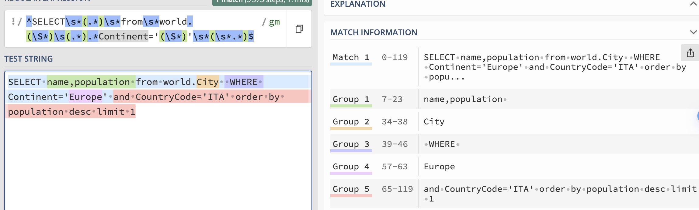

```
CREATE USER 'monitor'@'%' IDENTIFIED BY 'monitor';

# The user needs only USAGE privilege to connect, ping and check read_only which is granted by default. The user needs also REPLICATION CLIENT privilege if it needs to monitor replication lag. In this case execute:

GRANT USAGE, REPLICATION CLIENT ON *.* TO 'monitor'@'%';
```


# Create schemas 

in MySQL `create schema = create database`
```
Create schema Asia;
create schema Europe;
create schema North_America;
create schema Africa; 

create table Asia.city as select a.* from  world.city a join country on a.CountryCode = country.code where Continent='Asia' ;
create table Europe.city as select a.* from  world.city a join country on a.CountryCode = country.code where Continent='Europe' ;
create table Africa.city as select a.* from  world.city a join country on a.CountryCode = country.code where Continent='Africa' ;
create table North_America.city as select a.* from  world.city a join country on a.CountryCode = country.code where Continent='North America' ;

create table Asia.country as select * from  world.country where Continent='Asia' ;
create table Europe.country as select * from  world.country where Continent='Europe' ;
create table Africa.country as select * from  world.country  where Continent='Africa' ;
create table North_America.country as select * from  world.country where Continent='North America' ;
```

# Create user in MySQL instance

```
CREATE USER 'user_shardRW'@'%' IDENTIFIED BY 'test';
GRANT ALL PRIVILEGES ON *.* TO 'user_shardRW'@'%';
flush PRIVILEGES;
```

show tables from main;

# ProxySQL Admin

```
 docker exec -it proxy-sql-demo bash
# login into admin interface
mysql -u admin -padmin -h 127.0.0.1 -P6032 --prompt='Admin> ' 
```

Add user and hostgroup

```
insert into mysql_users (username,password,active,default_hostgroup,default_schema) values ('user_shardRW','test',1,10,'world');
LOAD MYSQL USERS TO RUNTIME;SAVE MYSQL USERS TO DISK;

INSERT INTO mysql_servers (hostname,hostgroup_id,port,weight) VALUES ('proxy-sql-demo-mysql1',10,3306,100);
INSERT INTO mysql_servers (hostname,hostgroup_id,port,weight) VALUES ('proxy-sql-demo-mysql1',20,3306,100);

<!-- INSERT INTO mysql_servers (hostname,hostgroup_id,port,weight) VALUES ('192.168.1.7',30,3306,100); -->

LOAD MYSQL SERVERS TO RUNTIME; SAVE MYSQL SERVERS TO DISK;
```

Create one query rule.

```
INSERT INTO mysql_query_rules (rule_id,active,username,match_pattern,replace_pattern,apply) VALUES (31,1,'user_shardRW',"^SELECT\s*(.*)\s*from\s*world.(\S*)\s(.*).*Continent='(\S*)'\s*(\s*.*)$","SELECT \1 from \4.\2 WHERE 1=1 \5",1);

LOAD MYSQL QUERY RULES TO RUNTIME;SAVE MYSQL QUERY RULES TO DISK;
```

Equivalent to following: 

match 
```
SELECT name,population from world.city  WHERE Continent='Europe' and CountryCode='ITA' order by population desc limit 1;
```
from 
```
/^SELECT\s*(.*)\s*from\s*world.(\S*)\s(.*).*Continent='(\S*)'\s*(\s*.*)$/gm
```
to
```
SELECT \1 from \4.\2 WHERE 1=1 \5
```




Connect ProxySQL via port 6033

mysql  -uuser_shardRW -ptest -P6033

```
select from name, population from Europe.city where 1=1 and CountryCode='ITA' order by population desc limit 1
```

# disable a query rule

```
update mysql_query_rules set active=0 where rule_id=31;
LOAD MYSQL QUERY RULES TO RUNTIME;SAVE MYSQL QUERY RULES TO DISK; 
```


```sql
[Pa]
delete from mysql_query_rules where rule_id in (31,33,34,35,36);

# '/* continent=Asia */' => null
INSERT INTO mysql_query_rules (rule_id,active,username,match_pattern,replace_pattern,apply,FlagOUT,FlagIN) VALUES (31,1,'user_shardRW',"\S*\s*\/\*\s*continent=.*Asia\s*\*.*",null,0,23,0);

# 'world.country' => 'Asia.country'
INSERT INTO mysql_query_rules (rule_id,active,username,match_pattern,replace_pattern,apply,FlagIN,FlagOUT) VALUES (32,1,'user_shardRW','world.','Asia.',0,23,23);

# '/* continent=Europe */' => null
INSERT INTO mysql_query_rules (rule_id,active,username,match_pattern,replace_pattern,apply,FlagOUT,FlagIN, log) VALUES (33,1,'user_shardRW',"\S*\s*\/\*\s*continent=.*Europe\s*\*.*",null,0,25,0, 1);

# QR 34 has FlagIN and FlagOUT pointing to the same value of 25 and Apply =0.
# This brings ProxySQL to recursively call rule 34 until it changes ALL the values of the word world.

# Warning, tested several times, this doesn't work. 

INSERT INTO mysql_query_rules (rule_id,active,username,match_pattern,replace_pattern,apply,FlagIN,FlagOUT, log) VALUES (34,1,'user_shardRW','world.','Europe.',0,25,25, 1);


# '/* continent=Africa */' => null

INSERT INTO mysql_query_rules (rule_id,active,username,match_pattern,replace_pattern,apply,FlagOUT,FlagIN) VALUES (35,1,'user_shardRW',"\S*\s*\/\*\s*continent=.*Africa\s*\*.*",null,0,24,0);

# 'world.country' => 'Africa.country'
INSERT INTO mysql_query_rules (rule_id,active,username,match_pattern,replace_pattern,apply,FlagIN,FlagOUT) VALUES (36,1,'user_shardRW','world.','Africa.',0,24,24);


LOAD MYSQL QUERY RULES TO RUNTIME;
SAVE MYSQL QUERY RULES TO DISK;
```


```
Select /* continent=Europe */ Code, city.Name, city.Population  from world.country join world.city on world.city.CountryCode=world.country.Code where city.Population > 10000 order by city.Population desc limit 5;
```

```
SELECT  active
       ,hits
       ,mysql_query_rules.rule_id
       ,match_digest
       ,match_pattern
       ,replace_pattern
       ,cache_ttl
       ,apply
       ,flagIn
       ,flagOUT
FROM mysql_query_rules NATURAL
JOIN stats.stats_mysql_query_rules
ORDER BY mysql_query_rules.rule_id;
```

## Profile 


select rule_id,active,username,match_pattern,replace_pattern,apply,FlagOUT,FlagIN, log from mysql_query_rules;


select digest_text from stats_mysql_query_digest

# Find frequent queries

count_star: The total number of times the query pattern has been executed.
```
SELECT digest, digest_text, count_star, sum_time, min_time, max_time
FROM stats_mysql_query_digest
ORDER BY count_star DESC
LIMIT 10;
```